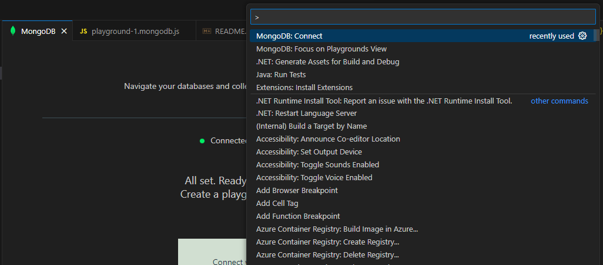
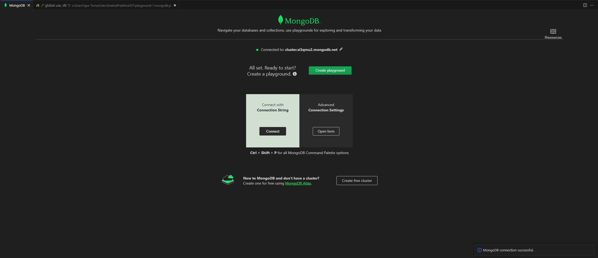
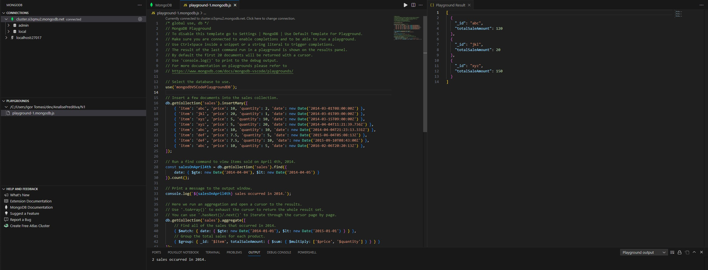
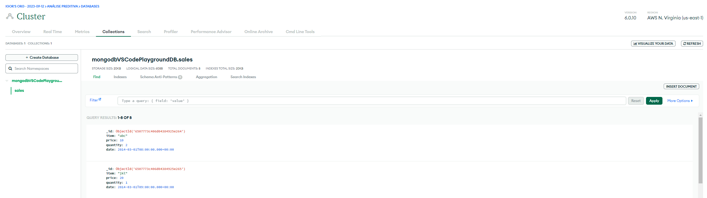

# Banco de Dados NoSQL (MongoDB)

O modelo de dados orientado a documentos oferecido pelo MongoDB apresenta várias vantagens que podem torná-lo uma escolha ideal para muitos casos de uso.

Flexibilidade de Esquema: Uma das principais vantagens do MongoDB é a flexibilidade de esquema que ele oferece. Diferentemente dos bancos de dados relacionais tradicionais, onde você precisa definir um esquema rígido com antecedência, o MongoDB permite que você armazene documentos em coleções sem a necessidade de um esquema pré-definido.

Capacidade de Armazenar Dados Complexos: O modelo de documentos no MongoDB permite que você armazene dados complexos e aninhados em um único documento. Isso significa que você pode representar objetos do mundo real de forma mais natural, sem a necessidade de dividi-los em várias tabelas relacionadas.

# Definição do Modelo 

O modelo orientado a documentos é um paradigma de modelagem de dados usado em bancos de dados NoSQL, como o MongoDB. Nesse modelo, os dados são organizados e armazenados em documentos individuais, que podem ser comparados a objetos ou registros em um banco de dados relacional. Cada documento contém um conjunto de pares chave-valor, onde as chaves são identificadores únicos e os valores podem ser estruturas de dados complexas, como arrays, subdocumentos ou até mesmo dados binários.

No modelo orientado a documentos, assim como no modelo relacional, os dados são organizados em "bancos de dados". No entanto, é aqui que começam a surgir algumas diferenças significativas. Enquanto no modelo relacional as entidades são representadas como "tabelas", com cada tabela contendo colunas que têm definições específicas, no modelo orientado a documentos, as entidades são referidas como "coleções" e cada unidade de dados dentro de uma coleção é chamada de "documento". Em vez de colunas, os documentos têm "atributos" que podem conter diferentes tipos de dados.

# Exemplo

Para realizar exemplos de manipulação de dados usando o MongoDB, você pode aproveitar o serviço de nuvem MongoDB Atlas. Este serviço oferece planos e assinaturas variados, mas também disponibiliza um plano gratuito, ideal para fins de teste e estudo.

Para obter informações detalhadas sobre como configurar a autenticação e começar a usar o MongoDB Atlas, você pode seguir o tutorial fornecido neste link: [Tutorial](https://blog.cod3r.com.br/como-utilizar-mongodb-atlas/).

Farei uma integração com o visual studio usando a própria extensão do MongoDB.

1 - Faça a autenticação com sua string connection

2 - Com sua conexão estabelecida com sucesso, a opção de criar um novo playground irá aparecer

3 - Criando seu playground será gerado um template de comandos para sua demonstração

4 - Rode o comando através do botão de Play do visual e em seguinda verifique no Atlas as collections criadas

